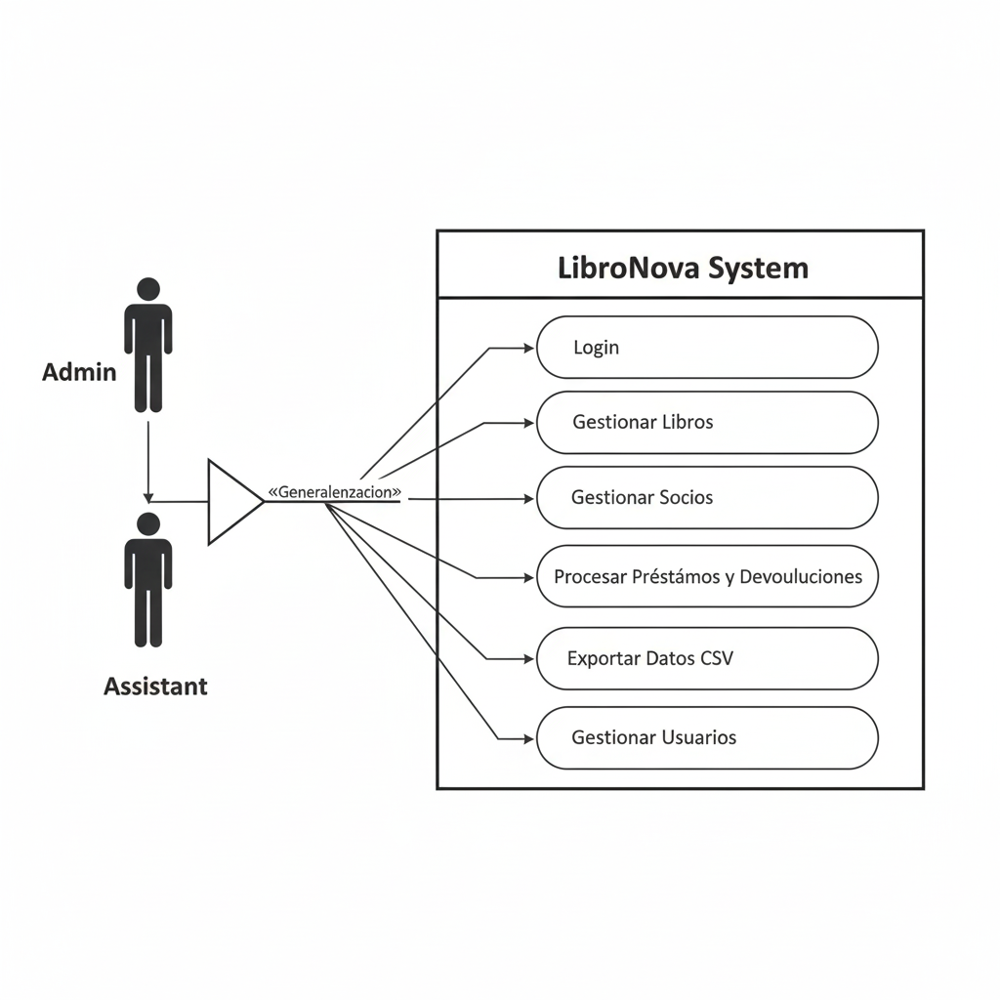

# LibroNova - Library Management System

## Overview

LibroNova is a comprehensive library management system developed in Java SE 17 with a Swing-based graphical interface using JOptionPane. The system implements a layered architecture with JDBC for database persistence, file handling for configuration and data export, and comprehensive unit testing with JUnit 5.

## System Features

### Core Functionality
- **Book Management**: Complete CRUD operations for library catalog
- **Partner Management**: Member registration and management
- **Loan Management**: Book lending with transaction support
- **User Management**: System user administration with role-based access
- **Data Export**: CSV export functionality for books and overdue loans
- **Authentication**: Secure login system with role-based permissions

### Technical Features
- **Layered Architecture**: Controller → Service → DAO → Model
- **Database Transactions**: ACID compliance for loan operations
- **Exception Handling**: Custom exceptions with comprehensive error management
- **File Management**: Configuration files and CSV export
- **Logging**: Comprehensive application logging
- **Unit Testing**: JUnit 5 test suite for business logic validation

## Developer Information

**Name**: Samuel David Arena Jimenez  
**Clan**: Cienega  
**Email**: samyarena2005@gmail.com  
**C.C**: 1042244679

## Prerequisites

### Software Requirements
- **Java**: JDK 17 or higher
- **Maven**: 3.6.0 or higher
- **MySQL**: 8.0 or higher
- **IDE**: IntelliJ IDEA, Eclipse, or NetBeans (recommended)

### Database Setup
1. Install MySQL server
2. Create database user with appropriate permissions
3. Run the SQL script provided in `src/main/resources/database.sql`

## Installation and Configuration

### 1. Clone the Repository
```bash
git clone https://github.com/s4mue3l2005/LibroNova.git
cd LibroNova
```

### 2. Database Configuration
1. Create MySQL database and user:
```bash
mysql -u root -p < NovaBook/src/main/resources/database.sql
```

The script will:
- Create the `libronova` database
- Create a dedicated user `novabook_user` with secure password
- Grant appropriate privileges
- Create all necessary tables with sample data

### 3. Application Configuration
Update the database configuration in `src/main/resources/config.properties`:

```properties
# Database Configuration
db.url=jdbc:mysql://localhost:3306/libronova
db.user=novabook_user
db.password=novabook!123

# Business Rules Configuration
diasPrestamo=7
multaPorDia=1500

# Logging Configuration
log.level=INFO
log.file=app.log
```

**Note**: The configuration is already set up with the secure database credentials. No changes needed unless you want to customize the settings.

### 4. Build and Run
```bash
cd NovaBook
mvn clean compile
mvn exec:java
```

### 5. Run Tests
```bash
mvn test
```

## Default Login Credentials

- **Username**: admin
- **Password**: admin123
- **Role**: ADMIN

## Project Structure

### Directory Structure
```
LibroNova/
├── README.md                                    # Project documentation
├── .gitignore                                   # Git ignore file
└── NovaBook/                                    # Main Maven project
    ├── pom.xml                                  # Maven configuration
    ├── src/
    │   ├── main/
    │   │   ├── java/com/codeup/novabook/
    │   │   │   ├── NovaBook.java               # Main application class
    │   │   │   ├── controller/                 # UI Controllers
    │   │   │   │   ├── BookController.java     # Book management UI
    │   │   │   │   ├── PartnerController.java  # Partner management UI
    │   │   │   │   ├── LoanController.java     # Loan management UI
    │   │   │   │   ├── UserController.java     # User management UI
    │   │   │   │   └── ExportController.java   # Data export UI
    │   │   │   ├── service/                    # Business Logic Layer
    │   │   │   │   ├── BookService.java        # Book service interface
    │   │   │   │   ├── PartnerService.java     # Partner service interface
    │   │   │   │   ├── LoanService.java        # Loan service interface
    │   │   │   │   ├── UserService.java        # User service interface
    │   │   │   │   └── impl/                   # Service implementations
    │   │   │   │       ├── BookServiceImpl.java
    │   │   │   │       ├── PartnerServiceImpl.java
    │   │   │   │       ├── LoanServiceImpl.java
    │   │   │   │       └── UserServiceImpl.java
    │   │   │   ├── dao/                        # Data Access Layer
    │   │   │   │   ├── BookDAO.java            # Book DAO interface
    │   │   │   │   ├── PartnerDAO.java         # Partner DAO interface
    │   │   │   │   ├── LoanDAO.java            # Loan DAO interface
    │   │   │   │   ├── UserDAO.java            # User DAO interface
    │   │   │   │   └── impl/                   # DAO implementations
    │   │   │   │       ├── BookDAOImpl.java
    │   │   │   │       ├── PartnerDAOImpl.java
    │   │   │   │       ├── LoanDAOImpl.java
    │   │   │   │       └── UserDAOImpl.java
    │   │   │   ├── model/                      # Domain Models
    │   │   │   │   ├── Book.java               # Book entity
    │   │   │   │   ├── Partner.java            # Partner entity
    │   │   │   │   ├── Loan.java               # Loan entity
    │   │   │   │   └── User.java               # User entity
    │   │   │   ├── exception/                  # Custom Exceptions
    │   │   │   │   ├── LibroNovaException.java # Base exception
    │   │   │   │   ├── DuplicateISBNException.java
    │   │   │   │   ├── InsufficientStockException.java
    │   │   │   │   ├── InvalidLoanException.java
    │   │   │   │   └── AuthenticationException.java
    │   │   │   └── util/                       # Utility Classes
    │   │   │       ├── DatabaseConnection.java # DB connection utility
    │   │   │       ├── TableFormatter.java     # Table formatting utility
    │   │   │       ├── CSVExporter.java        # CSV export utility
    │   │   │       └── LoggerUtil.java         # Logging utility
    │   │   └── resources/                      # Configuration Files
    │   │       ├── config.properties           # Application configuration
    │   │       └── database.sql                # Database schema
    │   └── test/                               # Test Directory
    │       └── java/com/codeup/novabook/
    │           └── service/                    # Unit Tests
    │               ├── BookServiceTest.java    # Book service tests
    │               ├── LoanServiceTest.java    # Loan service tests
    │               └── UserServiceTest.java    # User service tests
    └── target/                                 # Maven build output
        ├── classes/                            # Compiled classes
        └── test-classes/                       # Compiled test classes
```

### Key Directories Explanation

- **`controller/`**: Contains all UI controllers that handle JOptionPane interactions
- **`service/`**: Business logic layer with interfaces and implementations
- **`dao/`**: Data Access Object layer for database operations
- **`model/`**: Domain entities representing business objects
- **`exception/`**: Custom exception classes for error handling
- **`util/`**: Utility classes for common functionality
- **`resources/`**: Configuration files and database scripts
- **`test/`**: Unit tests using JUnit 5

## System Architecture

### Layered Architecture

```
┌─────────────────────────────────────────┐
│              Controller Layer           │
│  (UserController, BookController, etc.) │
├─────────────────────────────────────────┤
│              Service Layer              │
│  (UserService, BookService, etc.)      │
├─────────────────────────────────────────┤
│               DAO Layer                 │
│  (UserDAO, BookDAO, etc.)              │
├─────────────────────────────────────────┤
│               Model Layer               │
│  (User, Book, Partner, Loan)           │
└─────────────────────────────────────────┘
```

## User Interface Screenshots

### Login Screen
The application starts with a login dialog requiring username and password authentication.

### Main Menu
After successful login, users see the main menu with options based on their role:
- Book Management
- Partner Management
- Loan Management
- Export Data
- User Management (Admin only)

### Book Management
- List all/active books
- Filter by category or author
- Add new books with ISBN validation
- Update book information
- Delete books (with validation)

### Partner Management
- Register new library members
- Update member information
- Search by document number
- Manage member status

### Loan Management
- Create new loans with stock validation
- Return books with fine calculation
- View active and overdue loans
- Transaction-based operations

## Business Rules

### Book Management
- ISBN must be unique across the catalog
- Total copies must be greater than 0
- Available copies cannot exceed total copies
- Books cannot be deleted if they have active loans

### Partner Management
- Document numbers must be unique
- Email addresses must be unique
- Partners cannot borrow if they have overdue books

### Loan Management
- Loans are created for 7 days by default
- Fine calculation: 1,500 per day for overdue books
- Stock is automatically updated when loans are created/returned
- All loan operations use database transactions

### User Management
- Usernames and emails must be unique
- Default role for new users is ASISTENTE
- Default status for new users is ACTIVO
- Users cannot delete their own accounts

## File Management

### Configuration Files
- `config.properties`: Database and business rule configuration
- `database.sql`: Database schema and sample data

### Export Files
- `libros_export_YYYYMMDD_HHMMSS.csv`: Complete book catalog
- `prestamos_vencidos_YYYYMMDD_HHMMSS.csv`: Overdue loans report
- `prestamos_export_YYYYMMDD_HHMMSS.csv`: Complete loan history

### Log Files
- `app.log`: Application activity and error logging

## Exception Handling

### Custom Exceptions
- `LibroNovaException`: Base exception class
- `DuplicateISBNException`: ISBN uniqueness violation
- `InsufficientStockException`: Insufficient book copies
- `InvalidLoanException`: Invalid loan operations
- `AuthenticationException`: Login failures

### Error Management
- All exceptions are logged with detailed information
- User-friendly error messages in JOptionPane dialogs
- Graceful error recovery where possible

## Testing

### Unit Tests
The project includes comprehensive unit tests using JUnit 5:

- **BookServiceTest**: Validates book management business rules
- **LoanServiceTest**: Tests loan operations and fine calculations
- **UserServiceTest**: Validates user management and authentication

### Test Coverage
- Parameter validation
- Business rule enforcement
- Exception handling
- Model validation

### Running Tests
```bash
mvn test
```

## Class Diagrams


### Domain Model
```
User
├── id: int
├── username: String
├── password: String
├── email: String
├── role: UserRole
├── status: UserStatus
└── timestamps

Book
├── id: int
├── isbn: String
├── title: String
├── author: String
├── category: String
├── copies: int
├── price: BigDecimal
└── status

Partner
├── id: int
├── documentNumber: String
├── firstName: String
├── lastName: String
├── email: String
├── contact: String
└── status

Loan
├── id: int
├── partnerId: int
├── bookId: int
├── dates: LocalDate
├── fine: BigDecimal
└── status
```

## Casos de uso



## Use Case Diagram

```
┌─────────────┐    ┌─────────────────┐
│   Admin     │    │   Assistant     │
└─────┬───────┘    └────────┬────────┘
      │                     │
      │                     │
      ▼                     ▼
┌─────────────────────────────────────┐
│           LibroNova System          │
│                                     │
│  • Manage Books                     │
│  • Manage Partners                  │
│  • Process Loans                    │
│  • Export Data                      │
│  • Manage Users (Admin only)        │
└─────────────────────────────────────┘
```


## Development Features

### Code Quality
- **Layered Architecture**: Clear separation of concerns
- **Dependency Injection**: Service layer dependencies
- **Exception Handling**: Comprehensive error management
- **Logging**: Detailed application logging
- **Documentation**: Extensive code documentation

### Best Practices
- **SOLID Principles**: Single responsibility, open/closed, etc.
- **Clean Code**: Readable and maintainable code
- **Design Patterns**: DAO, Service Layer, Decorator patterns
- **Transaction Management**: ACID compliance
- **Resource Management**: Try-with-resources for database connections

## Troubleshooting

### Common Issues

1. **Database Connection Failed**
   - Verify MySQL server is running
   - Check that the `novabook_user` exists with correct password
   - Ensure the `libronova` database exists and schema is loaded
   - Run the database script: `mysql -u root -p < NovaBook/src/main/resources/database.sql`

2. **Login Issues**
   - Use default credentials: admin/admin123
   - Check user status in database
   - Verify user role permissions

3. **Build Issues**
   - Ensure Java 17+ is installed
   - Check Maven configuration
   - Verify all dependencies are available

### Log Files
Check `app.log` for detailed error information and application activity.

## Future Enhancements

- Web-based interface
- Advanced reporting features
- Email notifications for overdue books
- Barcode scanning integration
- Multi-library support
- Advanced search and filtering
- Data backup and restore functionality

## License

This project is developed as part of a coding assessment for educational purposes.

## Contact

For questions or support, contact:
- **Email**: samyarena2005@gmail.com
- **Developer**: Samuel David Arena Jimenez

---

**LibroNova Library Management System**  
*Developed with Java SE 17, Maven, MySQL, and JUnit 5*